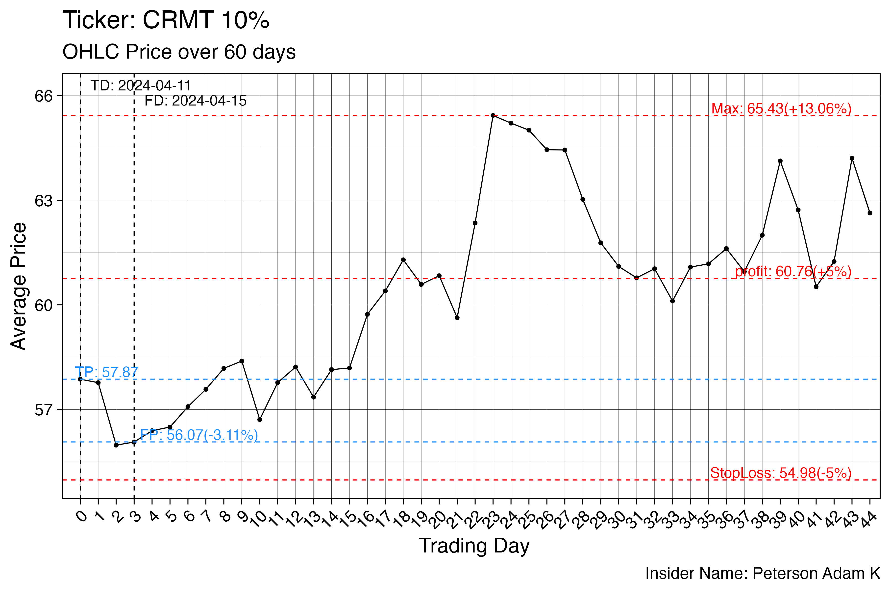
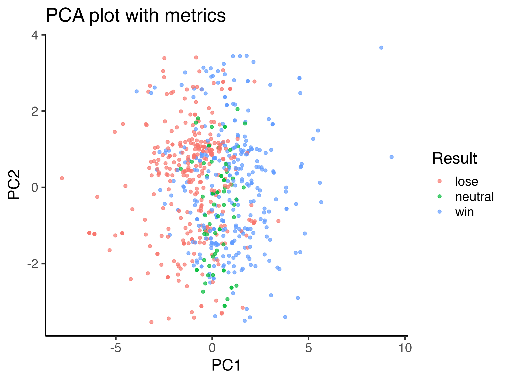

# BECX — Insider Trading Signal Analysis

This project builds a systematic pipeline to identify high-conviction insider purchase signals from US public disclosures, using R and Yahoo Finance data.

---

## Pipeline

**Stage 1 — Data collection** (`01_scalpData.R`)
All insider purchase filings for 2024 are scraped from [OpenInsider](http://openinsider.com) across paginated results of 1,000 rows each. The raw data is saved locally for downstream processing.


**Stage 2 — Filtering & enrichment** (`01_scalpData.R`)
A multi-step quality control filter is applied: removing untradeable tickers, missing prices, negative ownership changes, funds, and boilerplate filings. Only trades exceeding $500,000 in value and filed within 8 days of the trade date are retained. Each insider is tagged by role (CEO, Chairman, 10% owner, or other). 40 days of post-filing OHLC price data is then fetched from Yahoo Finance for each trade, alongside SPY as the market benchmark and VIX as the volatility proxy.

**Stage 3 — Trade visualisation** (`02_getTickers2024.R`)
A price chart is generated for each filtered trade, plotting OHLC or HL average prices over 60 trading days. Each chart is annotated with the trade date, filing date, trade price, filing price, stop-loss level, take-profit target, and the maximum price reached. Charts are organised into subfolders by days-to-file.



**Stage 4 — Win rate scoring** (`03_calcWinStrategy.r`)
A threshold-based strategy is applied to classify each trade. A trade is labelled a **win** if the OHLC price reaches ≥110% of the filing price within 30 days, a **loss** if it drops to ≤95%, and **neutral** if neither threshold is hit. The day and price at which the outcome occurs are recorded alongside the label.


**Stage 5 — PCA & performance metrics** (`04_analysisPCA.r`)
Per-trade financial metrics are computed including Sharpe ratio, maximum drawdown, alpha, beta, Jensen's alpha, Treynor ratio, and information ratio — benchmarked against SPY. These features are scaled and passed into a principal component analysis (PCA), with results visualised by insider role, days-to-file, and trade outcome. Win rates are also aggregated by individual insider and role group.



---

## Requirements

```r
install.packages(c("data.table", "rvest", "dplyr", "purrr",
                   "yahoofinancer", "quantmod", "tidyquant",
                   "ggplot2", "moments", "readxl"))
```
